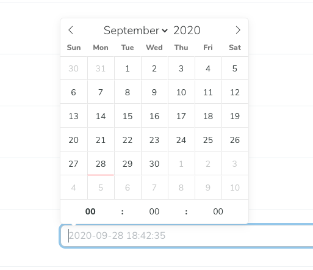
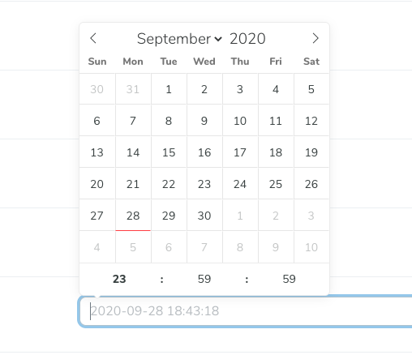

# Laravel Nova DateTime Picker Field - Set default time in datetime Picker
The API is extending default Nova DateTime field to add additional features.
Default Nova datetime picker always showing default time: 12:00:00 and don't have dynamic control on it.

### This package provides you full control to set default time in datetime picker. 
##### Default picker time is: 00:00:00




##### Use following method to set custom time:
- Hour `pickerDefaultHour(23)`
- Minute `pickerDefaultMinute(23)`
- Seconds `pickerDefaultSeconds(23)`



## Installation

You can install the package in to a Laravel app that uses [Nova](https://nova.laravel.com) via composer:

```bash
composer require jagdeepbanga/nova-date-time
```

## Usage

```php
<?php

use Jagdeepbanga\NovaDateTime\NovaDateTime as DateTime;

DateTime::make('End Date', 'end_date')
            ->pickerDefaultHour(23)  //Add default hour
            ->pickerDefaultMinute(59) //Add default minute
            ->pickerDefaultSeconds(59) //Add default seconds

```
